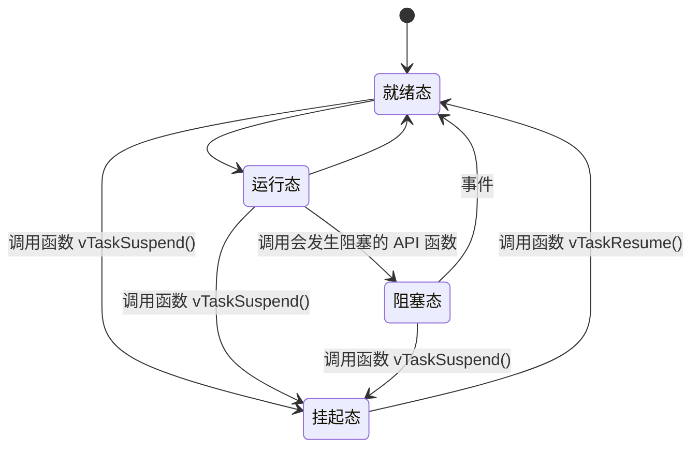

# FreeRTOS 的 1234

------

## FreeRTOS 简介

FreeRTOS是一个免费的嵌入式实时操作系统，他有以下特点

1. 免费开源
2. 可裁剪，核心代码 9000 多行，存在三个.c 文件中
3. 简单
4. 优先级不限，软件上任务优先级分配没有限制，多任务可以统一优先级；硬件上取决于位数
5. 任务不限，软件上可创建的实时任务数量没有限制，硬件上考虑到任务堆栈大小，上限与内存大小有关
6. 抢占 / 协程 / 时间片，支持抢占式、协程式、时间片流转任务调度

------

## FreeRTOS 官网

www.freertos.org

------

## ARM Cortex-M架构（待了解）

1. 《Cortex M3 权威指南（中文）》
2. 《Cortex M3 与 M4 权威指南》

------

## FreeRTOS 基础知识

### 任务调度器

FreeRTOS 支持的调度方式有以下三种：

1. 抢占式调度，每个任务都有一个优先级，优先级高的可以抢占优先级低的
2. 时间片调度，针对优先级相同的任务，给每个一任务分配一个时间片，时间片使用完后轮转，FreeRTOS 的时间片可设置，一个时间片等于 SysTick 中断周期；当某一个任务进入阻塞状态时，直接切换到下一个时间片运行下一个任务
3. 协程式调度，当前执行的任务将会一直运行，高优先级任务不会抢占（不重要，FreeRTOS 已经不会继续更新）

### 任务状态

1. 运行态，在 STM32 中同一时间只有一个任务处于运行态
2. 就绪态
3. 阻塞态，因为延迟或者等待外部事件发生
4. 挂起态，类似暂停，调用函数 vTaskSuspend() 进入挂起态，需要调用接挂函数 vTaskResume() 才可以进入就绪状态



这四种状态除了运行态，其他三种状态的任务都有其对应的**任务状态列表**，这些列表是一些链表数据结构

1. 就绪列表，pxReadyTasksLists[x]，其中 x 代表任务优先级数值，运行态的任务从就绪列表中挑选，挑选优先级最高的
2. 阻塞列表，pxDelayedTaskList
3. 挂起列表，xSuspendedTaskList

------

## FreeRTOS 源码

|      名称       |           内容           |
| :-------------: | :----------------------: |
|     include     |   包含 FreeRTOS 头文件   |
|    portable     | 包含 FreeRTOS 的移植文件 |
|   croutine.c    |       协程相关文件       |
| event_groups.c  |       事件相关文件       |
|     list.c      |       列表相关文件       |
|     queue.c     |       队列相关文件       |
| stream_buffer.c |    流式缓冲区相关文件    |
|     tasks.c     |       任务相关文件       |
|    timers.c     |    软件定时器相关文件    |

### portable内容

|  名称   |          内容          |
| :-----: | :--------------------: |
|  Keil   |    指向 RVDS 文件夹    |
|  RVDS   | 不同内核芯片的移植文件 |
| MemMang |      内存管理文件      |

------

## FreeRTOS 移植

### 移植步骤——《FreeRTOS 开发指南》第二章（目前没板子先不做实操）

1. 添加 FreeRTOS 源码
2. 添加 FreeRTOSConfig.h
3. 修改 SYSTEM 文件，修改 SYSTEM 文件中的 sys.c、delay.c、usart.c
4. 修改中断相关文件，修改 Systick 中断、SVC 中断、PendSV 中断
5. 添加应用程序，验证移植是否正确

------

## FreeRTOS任务创建和删除（待实操）

### 任务创建和删除的 API 函数

| API                 | 描述             |
| ------------------- | ---------------- |
| xTaskCreate()       | 动态方式创建任务 |
| xTaskCreateStatic() | 静态方式创建任务 |
| vTaskDelete()       | 删除任务         |

### 任务创建和删除（动态方法）

动态：任务的任务控制块以及任务的栈空间所需的内存是 FreeRTOS 系统从 FreeRTOS 管理的堆中分配

```c++
BaseType_t xTaskCreate (
  	TaskFuction_t pxTaskCode,																	/* 指向任务函数的指针 */
    const char* const pxName,																	/* 任务名字，最大长度 configMAX_TASK_NAME_LEN */
    const configSTACK_DEPTH_TYPE usStackDepth,								/* 任务堆栈大小，以字为单位，1 字 = 4 字节 */
    void* const pvParameters,																	/* 传递给任务函数的参数，一般为空 NULL */
    UBaseType_t uxPriority,																		/* 任务优先级 */
    TaskHandle_t* const pxCreatedTask													/* 任务句柄，就是任务的任务控制块
)
/*
 * 返回值:
 * pdPASS, 任务创建成功
 * errCOULD_NOT_ALLOCATE_REQUIRED_MEMORY, 任务创建失败
 */
```

#### 流程：

1. 将宏 configSUPPORT_DYNAMIC_ALLOCATION 置为 1
2. 定义函数入口参数
3. 编写任务函数

此函数创建的任务会立刻进入就绪态，由任务调度器调度运行

#### 内部实现

1. 申请堆栈内存 & 任务控制块内存
2. TCB （任务控制块）结构体成员赋值
3. 添加新任务到就绪任务中

#### 任务控制块结构体成员

```C++
typedef struct tskTaskControlBlock {
		volatile StackType_t *pxTopOfStack;													 /* 任务栈栈顶，必须为 TCB 的第一个成员 */
		ListItem_t xStateListItem;																	 /* 任务状态列表 */
  	ListItem_t xEventListItem;																	 /* 任务事件列表项 */
  	UBaseType_t uxPriority;																			 /* 任务优先级 */
  	StackType_t *pxStack；																				/* 任务栈起始地址 */
    char pcTaskName[configMAX_TASK_NAME_LEN];										 /* 任务名字 */
		...
} tskPCB;
```

### 任务创建和删除（静态方法）

静态：任务的任务控制块以及任务的栈空间所需的内存是用户分配

```
BaseType_t xTaskCreateStatic (
  	TaskFuction_t pxTaskCode,																	/* 指向任务函数的指针 */
    const char* const pcName,																	/* 任务名字，最大长度 configMAX_TASK_NAME_LEN */
    const uint32_t ulStackDepth,															/* 任务堆栈大小，以字为单位，1 字 = 4 字节 */
    void* const pvParameters,																	/* 传递给任务函数的参数，一般为空 NULL */
    UBaseType_t uxPriority,																		/* 任务优先级 */
    StackType_t* const puxStackBuffer,												/* 任务堆栈，一般为数组，由用户分配 */
    StaticTask_t* const pxTaskBuffer													/* 任务控制块指针，由用户分配 */
)
/*
 * 返回值:
 * NULL, 用户没有提供相应的内存，任务创建失败
 * 其他值，任务句柄
 */
```

#### 流程

1. 将宏 configSUPPORT_STATIC_ALLOCATION 置为 1
2. 定义空闲任务（必）、定时器任务的任务堆栈（可选）及 TCB
3. 实现两个接口函数vApplicationGetIdleTaskMemory()、vApplicationGetTimerTaskMemory()
4. 定义函数入口参数
5. 编写任务函数

#### 内部实现

1. TCB （任务控制块）结构体成员赋值
2. 添加新任务到就绪任务中

### 任务删除函数

```
/*
 * xTaskToDelete 待删除任务的任务句柄
 * 用于删除已被创建的任务
 * 被删除的任务将从就绪态任务列表、阻塞态任务列表、挂起态任务列表和事件列表中删除
 * 注意：
 * 1. 当传入参数为 NULL，则代表删除任务自身
 * 2. 空闲任务会负责释放被删除任务中由系统分配的内存（动态创建），但是由用户在任务删除前申请的内存（静态创建），则需要由用户在任务被删除前提前释放，否则将导致内存泄露
 */
void vTaskDelete(TaskHandle_t xTaskToDelete);
```

xTaskToDelete是待删除任务的任务句柄

该函数用于删除已被创建的任务，被删除的任务将从就绪态任务列表、阻塞态任务列表、挂起态任务列表和事件列表中删除

#### 注意：

1. 当传入参数为 NULL，则代表删除任务自身
2. 空闲任务会负责释放被删除任务中由系统分配的内存（动态创建），但是由用户在任务删除前申请的内存（静态创建），则需要由用户在任务被删除前提前释放，否则将导致内存泄露

#### 流程

1. 宏配置 INCLUDE_vTaskDelete 1
2. 入口参数传入需要删除的任务句柄（NULL 代表删除本身）

#### 内部实现

1. 获取索要删除的任务的控制块
2. 将被删除任务移除所在列表
3. 判断所需要删除的任务，删除任务自身，需要先添加到等待删除列表，内存释放将在空闲任务执行；删除其他任务，释放内存，任务数量—；
4. 更新下个任务的阻塞时间，以防被删除的任务是下一个阻塞超时的任务
