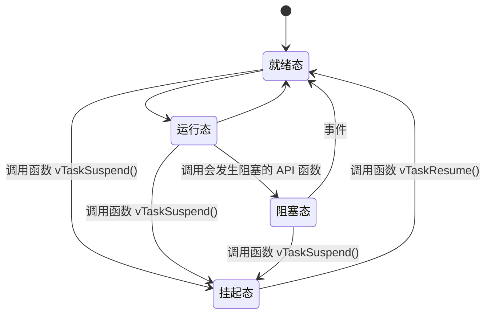

# FreeRTOS 的 1234

------

------

## FreeRTOS 简介

FreeRTOS是一个免费的嵌入式实时操作系统，他有以下特点

1. 免费开源
2. 可裁剪，核心代码 9000 多行，存在三个.c 文件中
3. 简单
4. 优先级不限，软件上任务优先级分配没有限制，多任务可以统一优先级；硬件上取决于位数
5. 任务不限，软件上可创建的实时任务数量没有限制，硬件上考虑到任务堆栈大小，上限与内存大小有关
6. 抢占 / 协程 / 时间片，支持抢占式、协程式、时间片流转任务调度

------

## FreeRTOS 官网

www.freertos.org

------

## ARM Cortex-M架构（待了解）

1. 《Cortex M3 权威指南（中文）》
2. 《Cortex M3 与 M4 权威指南》

------

## FreeRTOS 基础知识

### 任务调度器

FreeRTOS 支持的调度方式有以下三种：

1. 抢占式调度，每个任务都有一个优先级，优先级高的可以抢占优先级低的
2. 时间片调度，针对优先级相同的任务，给每个一任务分配一个时间片，时间片使用完后轮转，FreeRTOS 的时间片可设置，一个时间片等于 SysTick 中断周期；当某一个任务进入阻塞状态时，直接切换到下一个时间片运行下一个任务
3. 协程式调度，当前执行的任务将会一直运行，高优先级任务不会抢占（不重要，FreeRTOS 已经不会继续更新）

### 任务状态

1. 运行态，在 STM32 中同一时间只有一个任务处于运行态
2. 就绪态
3. 阻塞态，因为延迟或者等待外部事件发生
4. 挂起态，类似暂停，调用函数 vTaskSuspend() 进入挂起态，需要调用接挂函数 vTaskResume() 才可以进入就绪状态

这四种状态除了运行态，其他三种状态的任务都有其对应的**任务状态列表**，这些列表是一些链表数据结构

1. 就绪列表，pxReadyTasksLists[x]，其中 x 代表任务优先级数值，运行态的任务从就绪列表中挑选，挑选优先级最高的
2. 阻塞列表，pxDelayedTaskList
3. 挂起列表，xSuspendedTaskList

------

## FreeRTOS 源码

|      名称       |           内容           |
| :-------------: | :----------------------: |
|     include     |   包含 FreeRTOS 头文件   |
|    portable     | 包含 FreeRTOS 的移植文件 |
|   croutine.c    |       协程相关文件       |
| event_groups.c  |       事件相关文件       |
|     list.c      |       列表相关文件       |
|     queue.c     |       队列相关文件       |
| stream_buffer.c |    流式缓冲区相关文件    |
|     tasks.c     |       任务相关文件       |
|    timers.c     |    软件定时器相关文件    |

### portable内容

|  名称   |          内容          |
| :-----: | :--------------------: |
|  Keil   |    指向 RVDS 文件夹    |
|  RVDS   | 不同内核芯片的移植文件 |
| MemMang |      内存管理文件      |

------

## FreeRTOS 移植

